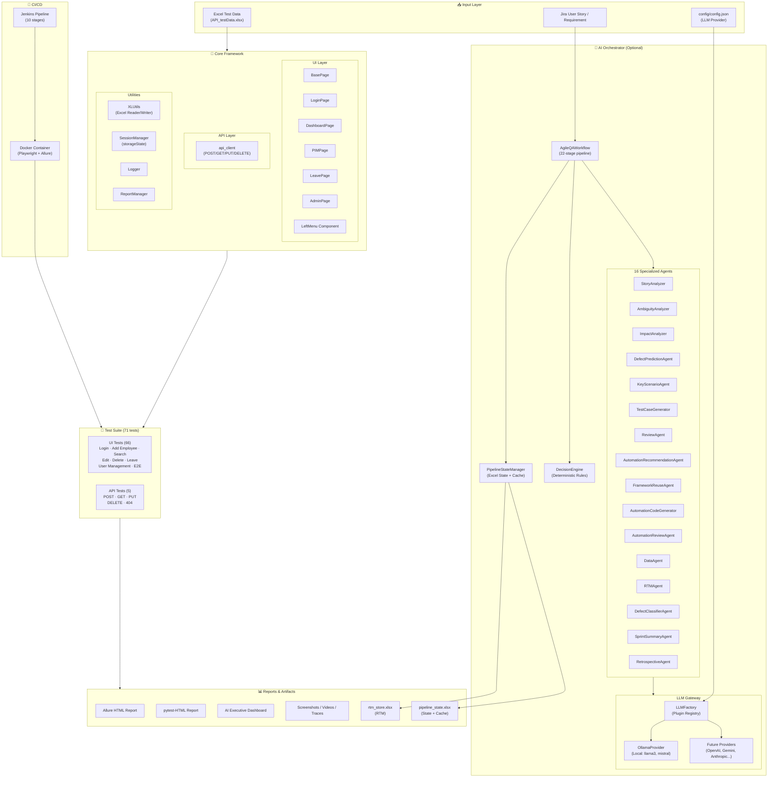

# 🤖 AI-Powered QA Orchestrator

> **Enterprise-grade QA Automation Framework** — Python · Pytest · Playwright · AI Orchestrator · Docker · CI/CD

[](https://www.python.org/)
[](https://playwright.dev/)
[](https://pytest.org/)
[](https://www.docker.com/)
[](https://github.com/features/actions)
[](https://www.jenkins.io/)
[](https://allurereport.org/)
[](LICENSE)

---

## 📋 Overview

The **AI-Powered QA Orchestrator** is a production-ready, enterprise-grade test automation framework that combines traditional QA automation best practices with an optional AI pipeline. It automates the full Agile QA lifecycle — from raw Jira user stories to executed test results, RTM updates, and executive dashboards.

The framework targets **OrangeHRM** as the application under test and demonstrates real-world patterns applicable to any web application.

**Key highlights:**

- **71 automated tests** across UI (66) and API (5) layers
- **22-stage AI pipeline** covering the complete Agile QA lifecycle
- **16 specialized AI agents** — each with a single, well-defined responsibility
- **Zero AI dependency** — the framework runs completely without AI; AI is an optional productivity layer
- **Full observability** — Allure HTML reports, pytest-HTML reports, AI Dashboard, screenshots, videos, and Playwright traces
- **Production-grade CI/CD** — Jenkins pipeline + Docker containerization

> **The framework works completely without AI. AI is an optional productivity layer.**

---

## ✨ Features

| Category | Features |
|---|---|
| **UI Automation** | Playwright-based E2E tests, Page Object Model, multi-browser support (Chromium, Firefox, Edge) |
| **API Automation** | Data-driven REST API tests (POST/GET/PUT/DELETE), Excel-driven payloads, response persistence |
| **AI Orchestrator** | 22-stage Agile QA pipeline, 16 specialized agents, LLM-agnostic provider registry |
| **Test Data** | Excel-driven test data (`API_testData.xlsx`), env-var overrides, safe defaults |
| **Reporting** | Allure HTML, pytest-HTML, AI Executive Dashboard, screenshots, videos, Playwright traces |
| **CI/CD** | Jenkins declarative pipeline (10 stages), Docker containerization, GitHub Actions ready |
| **RTM** | Auto-generated Requirement Traceability Matrix (`rtm_store.xlsx`) with coverage metrics |
| **State Management** | Persistent pipeline state (`pipeline_state.xlsx`), 5-layer deduplication, SHA-256 caching |
| **Test Marks** | `smoke`, `unit`, `integration`, `ui`, `api`, `security`, `boundary`, `regression` |
| **Session Management** | Playwright `storageState.json` for pre-authenticated browser sessions |
| **Parallel Execution** | `pytest-xdist` support for parallel test runs |

---

## 🏗️ Architecture Diagram



---

## 📁 Project Folder Structure

```
AI-Powered QA Orchestrator/
│
├── 📄 conftest.py                    # pytest fixtures & hooks (page, session, Allure)
├── 📄 conftest_allure_patch.py       # Allure FileLogger path patch (Windows fix)
├── 📄 pytest.ini                     # pytest configuration & custom marks
├── 📄 requirements.txt               # Python dependencies
├── 📄 run_pipeline.py                # AI pipeline entry point
├── 🐳 Dockerfile                     # Docker image (Playwright + Java + Allure CLI)
├── 🔧 Jenkinsfile                    # Jenkins declarative pipeline (10 stages)
├── 🔒 .gitignore
├── 🐳 .dockerignore
│
├── 🤖 ai_orchestrator/               # AI Orchestrator module
│   ├── __init__.py
│   ├── llm_factory.py                # LLM plugin registry (provider-agnostic)
│   ├── pipeline_state_manager.py     # Persistent state (Excel), 5-layer deduplication
│   │
│   ├── agents/                       # 16 specialized AI agents
│   │   ├── requirement_analyzer_agent.py
│   │   ├── ambiguity_detection_agent.py
│   │   ├── impact_analysis_agent.py
│   │   ├── defect_prediction_agent.py
│   │   ├── key_scenario_agent.py
│   │   ├── test_case_generator_agent.py
│   │   ├── test_case_review_agent.py
│   │   ├── automation_recommendation_agent.py
│   │   ├── framework_reuse_agent.py
│   │   ├── automation_code_generator_agent.py
│   │   ├── automation_review_agent.py
│   │   ├── test_data_generator_agent.py
│   │   ├── rtm_generator_agent.py
│   │   ├── defect_classifier_agent.py
│   │   ├── sprint_summary_agent.py
│   │   ├── retrospective_agent.py
│   │   ├── test_report_analyzer_agent.py
│   │   └── ai_dashboard_agent.py     # Generates self-contained HTML dashboard
│   │
│   ├── orchestrator/
│   │   ├── workflow.py               # AgileQAWorkflow — 22-stage pipeline
│   │   └── decision_engine.py        # Deterministic rule engine (no LLM)
│   │
│   ├── llm/
│   │   └── gateway.py                # LLM gateway (retry, timeout, fallback)
│   │
│   ├── providers/
│   │   ├── base_provider.py          # BaseLLMProvider interface
│   │   └── ollama_provider.py        # Ollama (local LLM) provider
│   │
│   ├── schemas/
│   │   └── pipeline_schemas.py       # PipelineContext, Decision, RTMMetrics, etc.
│   │
│   ├── knowledge/
│   │   └── framework_inventory.py    # Static framework component registry
│   │
│   └── pipeline_state/
│       ├── pipeline_state.xlsx       # Agent cache, test cases, scripts registry
│       └── rtm_store.xlsx            # RTM, Key Scenarios, Risks, Coverage
│
├── 🔧 core/                          # Core framework modules
│   ├── common_modules.py             # result() — structured pass/fail logging
│   ├── e2e_testData.py               # Central path registry & test configuration
│   │
│   ├── api/
│   │   └── api_client.py             # REST API client (POST/GET/PUT/DELETE)
│   │
│   ├── config/
│   │   └── allure_config.py          # Allure paths, label derivation, CLI finder
│   │
│   ├── logger/
│   │   └── logger.py                 # Structured logging
│   │
│   ├── reports/
│   │   └── report_manager.py         # Allure generate, AI Dashboard, archive
│   │
│   ├── ui/
│   │   ├── session_manager.py        # Browser storageState management
│   │   │
│   │   ├── pages/                    # Page Object Model
│   │   │   ├── base_page.py          # BasePage — all UI interactions
│   │   │   ├── login_page.py
│   │   │   ├── dashboard_page.py
│   │   │   ├── pim_page.py
│   │   │   ├── leave_page.py
│   │   │   └── admin_page.py
│   │   │
│   │   ├── locators/                 # Element selectors (separated from pages)
│   │   │   ├── login_locator.py
│   │   │   ├── dashboard_locator.py
│   │   │   ├── pim_locator.py
│   │   │   ├── leave_locator.py
│   │   │   └── admin_locator.py
│   │   │
│   │   └── components/               # Reusable UI components
│   │       ├── left_menu.py
│   │       └── left_menu_locator.py
│   │
│   └── utils/
│       └── XLUtils.py                # Excel read/write utilities
│
├── ⚙️ config/
│   ├── config.example.json           # LLM provider config template
│   └── config.json                   # ⚠️ NOT committed — copy from example
│
├── 🧪 tests/
│   ├── ui/                           # UI test suite (66 tests)
│   │   ├── test_login.py             # TC-LOGIN-001..003 (3 tests)
│   │   ├── test_feature_login.py     # Feature login tests (3 tests)
│   │   ├── test_add_employee.py      # TC-EMP-001..014 (14 tests) — AI-generated
│   │   ├── test_employee_search.py   # Employee search (10 tests)
│   │   ├── test_edit_employee.py     # Edit employee (4 tests)
│   │   ├── test_delete_employee.py   # Delete employee (3 tests)
│   │   ├── test_user_management.py   # User management (2 tests)
│   │   ├── test_admin_user_management.py  # Admin user mgmt (4 tests)
│   │   ├── test_leave_management.py  # Leave management (3 tests)
│   │   ├── test_apply_for_leave.py   # Apply for leave (18 tests) — AI-generated
│   │   └── test_happy_path_e2e.py    # Happy path E2E (1 test)
│   │
│   └── api/                          # API test suite (5 tests)
│       └── test_positive_user_creation.py  # TC-API-001..006
│
├── 📊 testData/
│   └── API_testData.xlsx             # Excel test data (multi-sheet)
│
├── 📈 testReport/
│   ├── Execution_Backup/
│   │   ├── report/                   # Allure results, HTML report, AI Dashboard
│   │   ├── archive/                  # Timestamped report archives
│   │   └── backup/                   # pytest-HTML backups
│   ├── UI_Screenshots/               # Failure screenshots (auto-captured)
│   ├── Videos/                       # Test execution videos (.webm)
│   └── Traces/                       # Playwright trace files (.zip)
│
├── 🔐 storageState/
│   └── storageState.json             # Pre-authenticated browser session
│
├── 📦 allure/
│   └── categories.json               # Allure failure categories
│
└── 📜 scripts/
    ├── generate_ai_dashboard.py      # CLI: generate AI Dashboard from Allure results
    └── run_tests_and_build_allure.ps1 # PowerShell: run tests + build Allure report
```

---

## 🛠️ Technology Stack

| Layer | Technology | Version | Purpose |
|---|---|---|---|
| **Language** | Python | 3.10+ | Core framework language |
| **Test Runner** | Pytest | 8.3.5 | Test discovery, execution, hooks |
| **UI Automation** | Playwright | 1.49.0 | Browser automation (Chromium/Firefox/Edge) |
| **API Testing** | Requests | 2.32.3 | REST API HTTP client |
| **Reporting** | Allure Pytest | 2.13.5 | Rich HTML test reports |
| **Reporting** | pytest-html | 4.1.1 | Self-contained HTML reports |
| **Parallel Exec** | pytest-xdist | 3.6.1 | Parallel test execution |
| **Test Data** | openpyxl | 3.1.5 | Excel read/write for test data & RTM |
| **AI — OpenAI** | openai | 1.57.0 | OpenAI provider (optional) |
| **AI — Gemini** | google-generativeai | 0.8.3 | Gemini provider (optional) |
| **AI — Local** | ollama | 0.4.4 | Local LLM (llama3, mistral, qwen) |
| **Containerization** | Docker | — | Playwright + Java + Allure CLI image |
| **CI/CD** | Jenkins | — | 10-stage declarative pipeline |
| **Report Server** | Allure CLI | 2.44.0 | HTML report generation |

---

## 🔩 Framework Components

### Page Object Model

| Class | File | Responsibility |
|---|---|---|
| `BasePage` | `core/ui/pages/base_page.py` | Root POM — all Playwright interactions with explicit waits |
| `LoginPage` | `core/ui/pages/login_page.py` | Authentication flows |
| `DashboardPage` | `core/ui/pages/dashboard_page.py` | Post-login navigation |
| `PIMPage` | `core/ui/pages/pim_page.py` | Employee management (Add/Search/Edit/Delete) |
| `LeavePage` | `core/ui/pages/leave_page.py` | Leave application and My Leave list |
| `AdminPage` | `core/ui/pages/admin_page.py` | Admin module — user management |
| `LeftMenu` | `core/ui/components/left_menu.py` | Left navigation menu component |

### Locators (Separated from Pages)

| File | Module |
|---|---|
| `core/ui/locators/login_locator.py` | Login page selectors |
| `core/ui/locators/dashboard_locator.py` | Dashboard selectors |
| `core/ui/locators/pim_locator.py` | PIM / Employee selectors |
| `core/ui/locators/leave_locator.py` | Leave module selectors |
| `core/ui/locators/admin_locator.py` | Admin module selectors |

### Core Utilities

| Module | Purpose |
|---|---|
| `core/utils/XLUtils.py` | Excel read/write — `read_api_data_from_excel()`, `get_excel_rows()`, `save_api_resp_in_excel()` |
| `core/common_modules.py` | `result(status, expected, actual)` — structured pass/fail logging with soft-fail support |
| `core/e2e_testData.py` | Central path registry, browser/URL/credentials config with env-var overrides |
| `core/ui/session_manager.py` | Playwright `storageState.json` save/load for pre-authenticated sessions |
| `core/reports/report_manager.py` | Post-test report pipeline: Allure generate, AI Dashboard, archive, backup |
| `core/logger/logger.py` | Structured logging |
| `core/config/allure_config.py` | Allure paths, dynamic label derivation, CLI finder |

### pytest Fixtures & Hooks (`conftest.py`)

| Hook / Fixture | Purpose |
|---|---|
| `page` fixture | Playwright browser page with video recording, tracing, and Allure attachment on failure |
| `pytest_configure` | Creates report directories, patches Allure FileLogger |
| `pytest_sessionstart` | Cleans allure-results, copies `categories.json` |
| `pytest_runtest_setup` | Applies dynamic Allure labels (feature/story/title) |
| `pytest_sessionfinish` | Triggers `ReportManager.generate_all()` — Allure + AI Dashboard |
| `pytest_runtest_makereport` | Captures call-phase report for screenshot/trace attachment |
| `pytest_runtest_logreport` | Patches Allure result JSON to attach captured stdout |

---

## 🖥️ UI Automation

The UI layer uses **Playwright** with the **Page Object Model** pattern against **OrangeHRM**.

### Implemented Test Scenarios

| Module | Test File | Tests | Test Types |
|---|---|---|---|
| **Login** | `test_login.py` | 3 | Valid login, Invalid login, Dashboard navigation |
| **Login (Feature)** | `test_feature_login.py` | 3 | Feature-level login scenarios |
| **Add Employee** | `test_add_employee.py` | 14 | Valid, Required fields, Duplicate ID, Password mismatch, Boundary, Security (SQLi/XSS) |
| **Employee Search** | `test_employee_search.py` | 10 | Search by name, partial name, filters |
| **Edit Employee** | `test_edit_employee.py` | 4 | Edit personal details |
| **Delete Employee** | `test_delete_employee.py` | 3 | Delete with confirmation |
| **User Management** | `test_user_management.py` | 2 | Create/manage users |
| **Admin User Mgmt** | `test_admin_user_management.py` | 4 | Admin-level user operations |
| **Leave Management** | `test_leave_management.py` | 3 | Leave list, status checks |
| **Apply for Leave** | `test_apply_for_leave.py` | 18 | Valid apply, invalid dates, missing fields, duplicate, balance check |
| **Happy Path E2E** | `test_happy_path_e2e.py` | 1 | Full end-to-end workflow |
| **Total** | | **66** | |

### Browser Support

| Browser | Config Value | Notes |
|---|---|---|
| Chromium | `chromium` | Default; available in Docker |
| Firefox | `firefox` | Available locally |
| Microsoft Edge | `edge` | Available on Windows only |

### On-Failure Artifacts

Every test failure automatically captures and attaches to Allure:
- 📸 **Full-page screenshot** (PNG)
- 🎬 **Video recording** (WebM)
- 🔍 **Playwright trace** (ZIP — viewable at `trace.playwright.dev`)

---

## 🔌 API Automation

The API layer uses **Requests** with **data-driven** test data from Excel.

### Target API

**Petstore API** — `https://petstore.swagger.io/v2`

### Implemented Test Cases

| Test Case | Method | Endpoint | Validates |
|---|---|---|---|
| `TC-API-001` | `POST` | `/user` | 200 OK, body structure, `code`/`type`/`message`, Content-Type |
| `TC-API-003` | `GET` | `/user/{username}` | 200 OK, all 8 fields, data types, field values, business rules |
| `TC-API-004` | `PUT` | `/user/{username}` | 200 OK, follow-up GET confirms updated values |
| `TC-API-005` | `DELETE` | `/user/{username}` | 200 OK, `message==username`, follow-up GET returns 404 |
| `TC-API-006` | `GET` | `/user/{nonexistent}` | 404, `code=1`, `type='error'`, `message='User not found'` |

### API Client Design

```python
# All API operations are pure functions — no class instantiation needed
from core.api.api_client import create_user, get_user, update_user, delete_user

response = create_user(cloud_env="QA", id=1, username="alice", ...)
```

- All test data read from `testData/API_testData.xlsx` → sheet `API_Data`
- Every response saved to `testReport/Execution_Backup/API_responses/`
- Every response written back to Excel column 8 for traceability
- Configurable timeout via `E2E_API_TIMEOUT` environment variable

---

## 🤖 AI Orchestrator

> **The framework works completely without AI. AI is an optional productivity layer.**

The AI Orchestrator is a **22-stage Agile QA pipeline** that transforms a raw Jira user story into a complete set of QA artifacts — test cases, automation scripts, test data, RTM, and executive reports.

### How AI Fits Into the Framework

```
Without AI:  Write tests manually → Run pytest → View Allure report
With AI:     Paste requirement → Run pipeline → AI generates everything → Review & run
```

The AI layer **augments** the QA engineer's productivity. It does not replace human judgment. Every AI output passes through the **DecisionEngine** (deterministic rules) before proceeding.

### Architectural Principle

```
AI DECIDES / RECOMMENDS  →  agents produce outputs
CODE VALIDATES           →  DecisionEngine applies deterministic rules
FRAMEWORK EXECUTES       →  pytest runs the actual tests
HUMAN APPROVES           →  ambiguity gate, release decision
RTM PROVIDES TRACEABILITY → every artifact linked to requirements
```

### LLM Provider Registry

The framework uses a **plugin registry** pattern — adding a new LLM requires only:
1. Create `ai_orchestrator/providers/my_provider.py` implementing `BaseLLMProvider`
2. Register it in `PROVIDER_REGISTRY` in `llm_factory.py`
3. Add config template to `config/config.example.json`

**Currently registered:** `ollama` (local LLM — llama3, mistral, qwen, etc.)

**Prepared for (not yet implemented):** OpenAI, Azure OpenAI, Gemini, Anthropic

### 16 Specialized Agents

| # | Agent | Responsibility |
|---|---|---|
| 1 | `StoryAnalyzer` | Requirement understanding + acceptance criteria analysis |
| 2 | `AmbiguityAnalyzer` | Detect blockers/critical ambiguities — **GATE** |
| 3 | `ImpactAnalyzer` | Identify affected components and regression scope |
| 4 | `DefectPredictionAgent` | FMEA risk analysis — predict likely defect areas |
| 5 | `KeyScenarioAgent` | Test strategy + key scenario extraction |
| 6 | `TestCaseGenerator` | Generate structured test cases with TC-IDs |
| 7 | `ReviewAgent` | Test case quality review — **GATE** |
| 8 | `AutomationRecommendationAgent` | Automation feasibility + strategy |
| 9 | `FrameworkReuseAgent` | Identify existing components to reuse |
| 10 | `AutomationCodeGenerator` | Generate pytest + Playwright test scripts |
| 11 | `AutomationReviewAgent` | Code review with retry loop — **GATE + RETRY** |
| 12 | `DataAgent` | Generate test data → `API_testData.xlsx` |
| 13 | `RTMAgent` | Generate Requirement Traceability Matrix |
| 14 | `DefectClassifierAgent` | Classify failures by root cause |
| 15 | `SprintSummaryAgent` | Sprint QA summary + release recommendation |
| 16 | `RetrospectiveAgent` | Retrospective insights for process improvement |

---

## 📊 Test Data Management

All test data is managed in a single Excel workbook: `testData/API_testData.xlsx`

### Excel Sheets

| Sheet | Purpose |
|---|---|
| `API_Common_Data` | Browser, headless mode, app URL, credentials, environment name |
| `Web_UI` | UI test data rows (e.g. `TC_AddEmployee_Valid`, `TC_Login_Valid`) |
| `API_Data` | API endpoint URLs, headers, payload templates |
| `UserManagement` | User CRUD test data |

### Environment Variable Overrides

All Excel values can be overridden via environment variables — useful in Docker/CI:

| Variable | Purpose | Default |
|---|---|---|
| `E2E_BROWSER` | Browser name (`chromium`/`firefox`/`edge`) | `chromium` |
| `E2E_HEADLESS` | Headless mode (`true`/`false`) | `false` |
| `E2E_APP_URL` | Application base URL | From Excel |
| `E2E_APP_USERNAME` | Login username | From Excel |
| `E2E_APP_PASSWORD` | Login password | From Excel |
| `E2E_API_TIMEOUT` | API request timeout (seconds) | `30` |
| `LLM_PROVIDER_CONFIG` | LLM config file path | `config/config.json` |
| `FORCE_RERUN` | Bypass AI pipeline cache (`1`/`0`) | `0` |
| `RUN_TESTS` | Execute pytest after AI generation (`1`/`0`) | `0` |

### Reading Test Data in Tests

```python
from core.utils.XLUtils import read_api_data_from_excel

# Read a named row from a sheet
data = read_api_data_from_excel("Web_UI", "TC_AddEmployee_Valid")
first_name = data.get("FirstName", "Alice")  # safe default if row missing

# Read multiple rows for parametrize
from core.utils.XLUtils import get_excel_rows

@pytest.mark.parametrize("data", get_excel_rows("Web_UI", [
    "TC_AddEmployee_Valid",
    "TC_AddEmployee_WithLogin",
]))
def test_add_employee(self, page, data):
    first_name = data.get("FirstName", "Default")
```

---

## 📋 Requirement Traceability Matrix

The RTM is automatically generated and maintained in `ai_orchestrator/pipeline_state/rtm_store.xlsx`.

### RTM Workbook Sheets

| Sheet | Columns | Purpose |
|---|---|---|
| **RTM** | Requirement ID, User Story, API/Screen, Test Case ID, Test Scenario, Priority, Test Type, Automation Status, Execution Status, Defect ID | Full traceability matrix |
| **Key Scenarios** | Key Scenario ID, Linked Requirements, req_hash, Last Updated | KS-XXX scenario registry |
| **Risks** | Risk ID, Linked Requirements, req_hash, Last Updated | RISK-XXX FMEA register |
| **Coverage** | Requirement Preview, Total Reqs, Covered, Not Covered, Total TCs, Automated, Manual, Total Risks | Coverage metrics per requirement |

### Pipeline State Workbook (`pipeline_state.xlsx`)

| Sheet | Purpose |
|---|---|
| **Requirements** | Processed requirements with SHA-256 hash, run count, agents completed |
| **Agent Log** | Per-agent execution log with timestamps |
| **Test Cases** | TC-XXX-NNN registry with full test case details |
| **Scripts** | Generated script file paths |
| **Cache** | Agent output cache (keyed by req_hash + agent_name) |

---

## 📈 Reports

### Allure HTML Report

Generated automatically after every test run at:
```
testReport/Execution_Backup/report/allure-report/index.html
```

Features:
- Test results by feature/story/severity
- Step-by-step execution details
- Failure screenshots, videos, and Playwright traces attached
- Environment properties (browser, platform, Python version)
- Custom failure categories (`allure/categories.json`)
- Historical trend (when using Jenkins Allure plugin)

### pytest-HTML Report

Self-contained HTML report at:
```
testReport/Execution_Backup/report/pytest_html_report.html
```

Timestamped backups saved to:
```
testReport/Execution_Backup/backup/Test_Report_QA_YYYYMMDD_HHMMSS.html
```

### AI Executive Dashboard

A polished, self-contained HTML dashboard generated from Allure results:
```
testReport/Execution_Backup/report/ai_dashboard_report.html
```

Features:
- KPI cards: Total, Passed, Failed, Skipped, Pass Rate, Duration
- Quality Gate: **PASS** (≥80%) / **WARN** (≥60%) / **FAIL** (<60%)
- Pass vs Fail distribution chart (Chart.js)
- Phase-wise execution status chart
- Top failed tests with error details
- Severity breakdown (BLOCKER/CRITICAL/NORMAL/MINOR/TRIVIAL)
- Advanced filters: by status, phase, severity, test ID, description
- Export to CSV / Excel
- Dark mode toggle
- Expandable per-test detail panel with steps, validation results, logs, screenshots

### Logs

Structured logs written during test execution via `core/logger/logger.py`.

### Screenshots / Videos / Traces

| Artifact | Location | Captured When |
|---|---|---|
| Screenshots (PNG) | `testReport/UI_Screenshots/` | On test failure only |
| Videos (WebM) | `testReport/Videos/` | Every test (deleted on pass) |
| Traces (ZIP) | `testReport/Traces/` | Every test (deleted on pass) |

---

## 🚀 Running the Project

### Prerequisites

- Python 3.10+
- Java 17+ (for Allure CLI)
- Allure CLI 2.44.0 ([installation guide](https://allurereport.org/docs/install/))
- OrangeHRM instance (local or cloud)

### 1. Clone the Repository

```bash
git clone https://github.com/<your-username>/ai-powered-qa-orchestrator.git
cd ai-powered-qa-orchestrator
```

### 2. Create Virtual Environment

```bash
# Windows
python -m venv venv
venv\Scripts\activate

# macOS / Linux
python -m venv venv
source venv/bin/activate
```

### 3. Install Dependencies

```bash
pip install -r requirements.txt
```

### 4. Install Playwright Browsers

```bash
playwright install chromium
# Optional: playwright install firefox
```

### 5. Configure Test Data

Copy the example config and update with your OrangeHRM URL and credentials:

```bash
# Windows
copy config\config.example.json config\config.json

# macOS / Linux
cp config/config.example.json config/config.json
```

Update `testData/API_testData.xlsx` → sheet `API_Common_Data`:

| Row | Column B |
|---|---|
| Row 3 | Browser (`chromium`) |
| Row 4 | Headless (`false`) |
| Row 5 | App URL (`http://your-orangehrm-url`) |
| Row 6 | Username (`Admin`) |
| Row 7 | Password (`admin123`) |

### 6. Run All Tests

```bash
pytest --tb=short -v
```

### 7. Run UI Tests Only

```bash
pytest tests/ui/ -m ui -v --tb=short
```

### 8. Run API Tests Only

```bash
pytest tests/api/ -m api -v --tb=short
```

### 9. Run Smoke Tests (CI Gate)

```bash
pytest -m smoke -v --tb=short
```

### 10. Run Regression Tests

```bash
pytest -m regression -v --tb=short
```

### 11. Generate Allure Report

```bash
allure generate testReport/Execution_Backup/report/allure-results \
  -o testReport/Execution_Backup/report/allure-report --clean

allure open testReport/Execution_Backup/report/allure-report
```

### 12. Generate AI Dashboard (standalone)

```bash
python scripts/generate_ai_dashboard.py \
  --allure-results-dir testReport/Execution_Backup/report/allure-results \
  --output-path testReport/Execution_Backup/report/ai_dashboard_report.html \
  --report-title "QA Executive Dashboard" \
  --application-name "OrangeHRM" \
  --suite-name "Regression Suite"
```

### 13. Run AI Pipeline

```bash
# 1. Configure LLM provider in config/config.json
# 2. Edit REQUIREMENT in run_pipeline.py
python run_pipeline.py
```

---

## 🐳 Docker

### Build the Image

```bash
docker build -t qa-ai-automation .
```

The image is based on `mcr.microsoft.com/playwright/python:v1.49.0-jammy` and includes:
- Python 3.10 + all dependencies
- Playwright Chromium
- Java 17 (OpenJDK headless)
- Allure CLI 2.44.0

### Run Tests Only

```bash
docker run --rm \
  -v ${PWD}/testReport:/app/testReport \
  -v ${PWD}/testData:/app/testData \
  qa-ai-automation
```

### Run Specific Test Suite

```bash
# UI tests only
docker run --rm \
  -v ${PWD}/testReport:/app/testReport \
  -v ${PWD}/testData:/app/testData \
  qa-ai-automation pytest tests/ui/ -m ui -v --tb=short

# API tests only
docker run --rm \
  -v ${PWD}/testReport:/app/testReport \
  -v ${PWD}/testData:/app/testData \
  qa-ai-automation pytest tests/api/ -m api -v --tb=short
```

### Run AI Pipeline in Docker

```bash
docker run --rm \
  -v ${PWD}/config/config.json:/app/config/config.json:ro \
  -v ${PWD}/testReport:/app/testReport \
  -v ${PWD}/testData:/app/testData \
  -v ${PWD}/ai_orchestrator/pipeline_state:/app/ai_orchestrator/pipeline_state \
  qa-ai-automation python run_pipeline.py
```

### Force Re-run (Bypass AI Cache)

```bash
docker run --rm -e FORCE_RERUN=1 \
  -v ${PWD}/testReport:/app/testReport \
  qa-ai-automation python run_pipeline.py
```

### Environment Variables in Docker

```bash
docker run --rm \
  -e E2E_BROWSER=chromium \
  -e E2E_HEADLESS=true \
  -e E2E_APP_URL=http://your-orangehrm-url \
  -e E2E_APP_USERNAME=Admin \
  -e E2E_APP_PASSWORD=admin123 \
  -v ${PWD}/testReport:/app/testReport \
  qa-ai-automation
```

> **Note:** `msedge` is not available on Linux. The Dockerfile sets `E2E_BROWSER=chromium` by default.

---

## ⚙️ CI/CD

### Jenkins Pipeline

The `Jenkinsfile` defines a **10-stage declarative pipeline** running inside the Playwright Docker image.

| Stage | Description | Duration |
|---|---|---|
| 1. Checkout | Clone repository | ~5s |
| 2. Install Dependencies | `pip install -r requirements.txt` | ~60s |
| 3. Install Playwright Browsers | `playwright install --with-deps chromium` | ~30s |
| 4. Install Allure CLI | Download + install Allure 2.44.0 | ~20s |
| 5. Prepare Directories | Create report/data directories | ~2s |
| 6. Run API Tests | 5 API tests, ~15s | ~15s |
| 7. Run UI Smoke Tests | `pytest -m smoke` — fast CI gate | ~5 min |
| 8. Run UI Regression | Full 66-test UI suite | ~20 min |
| 9. Generate Allure Report | `allure generate` | ~10s |
| 10. Generate AI Dashboard | `python scripts/generate_ai_dashboard.py` | ~5s |

**Post-actions:**
- Archives all reports as Jenkins artifacts
- Publishes Allure report in Jenkins UI (requires Allure Jenkins Plugin)
- Slack notifications (commented out — uncomment to enable)

**Jenkins environment variables:**

```groovy
environment {
    ALLURE_VERSION = '2.44.0'
    E2E_HEADLESS   = 'true'
    E2E_BROWSER    = 'chromium'
}
```

### GitHub Actions

The project is structured for GitHub Actions integration. A sample workflow:

```yaml
name: QA Automation

on: [push, pull_request]

jobs:
  test:
    runs-on: ubuntu-latest
    container:
      image: mcr.microsoft.com/playwright/python:v1.49.0-jammy

    steps:
      - uses: actions/checkout@v4

      - name: Install dependencies
        run: pip install -r requirements.txt

      - name: Install Playwright browsers
        run: playwright install --with-deps chromium

      - name: Run API tests
        run: pytest tests/api/ -m api -v --tb=short

      - name: Run UI smoke tests
        run: pytest -m smoke -v --tb=short
        env:
          E2E_HEADLESS: "true"
          E2E_BROWSER: "chromium"

      - name: Run UI regression
        run: pytest tests/ui/ -m ui -v --tb=short
        env:
          E2E_HEADLESS: "true"

      - name: Upload test reports
        uses: actions/upload-artifact@v4
        if: always()
        with:
          name: test-reports
          path: testReport/Execution_Backup/report/
```

---

## 🔄 AI Workflow

The `AgileQAWorkflow` implements a **22-stage Agile QA pipeline**:

```
Jira / User Story
        │
        ▼
[1]  Requirement Understanding      (StoryAnalyzer)
        │
        ▼
[2]  Ambiguity Detection            (AmbiguityAnalyzer) ◄── GATE
        │  CLEAR → proceed
        │  NEEDS_CLARIFICATION → PAUSE (surface questions to human)
        ▼
[3]  Impact Analysis                (ImpactAnalyzer)
        │
        ▼
[4]  Risk Analysis (FMEA)           (DefectPredictionAgent)
        │
        ▼
[5]  Test Strategy / Key Scenarios  (KeyScenarioAgent)
        │
        ▼
[6]  Test Case Generation           (TestCaseGenerator)
        │
        ▼
[7]  Test Case Review               (ReviewAgent) ◄── GATE
        │
        ▼
[8]  Automation Feasibility         (AutomationRecommendationAgent)
        │
        ▼
[9]  Framework Reuse Analysis       (FrameworkReuseAgent)
        │
        ▼
[10] Automation Code Generation     (AutomationCodeGenerator)
        │
        ▼
[11] Automation Code Review         (AutomationReviewAgent) ◄── GATE + RETRY (max 2)
        │  APPROVED → proceed
        │  NEEDS_REVISION → regenerate with feedback
        ▼
[12] Test Data Generation           (DataAgent → API_testData.xlsx)
        │
        ▼
[13] RTM Generation                 (RTMAgent → rtm_store.xlsx)
        │
        ▼
[14] RTM Compliance Validation      (DecisionEngine) ◄── GATE
        │
        ▼
[15] Pytest Execution               (subprocess — optional, RUN_TESTS=1)
        │
        ▼
[16] Failure Analysis               (TestReportAnalyzerAgent — optional)
        │
        ▼
[17] Defect Classification          (DefectClassifierAgent — optional)
        │
        ▼
[18] RTM Update                     (PipelineStateManager)
        │
        ▼
[19] Sprint QA Summary              (SprintSummaryAgent)
        │
        ▼
[20] Release Readiness Assessment   (DecisionEngine → GO / CONDITIONAL_GO / NO_GO)
        │
        ▼
[21] Retrospective Insights         (RetrospectiveAgent)
        │
        ▼
        📊 Output Artifacts:
           ✅ pipeline_state.xlsx  (test cases, scripts, agent log, cache)
           ✅ rtm_store.xlsx       (RTM, key scenarios, risks, coverage)
           ✅ API_testData.xlsx    (generated test data)
           ✅ tests/ui/test_*.py   (generated automation scripts)
           ✅ Console output       (analysis, summary, retrospective)
```

### Pipeline Caching

The pipeline uses **SHA-256 hashing** to cache agent outputs. Re-running the same requirement skips already-completed agents:

```bash
# First run — all agents execute
python run_pipeline.py

# Second run — all outputs loaded from cache (fast)
python run_pipeline.py

# Force re-run — bypass cache
FORCE_RERUN=1 python run_pipeline.py
```

---

## 🎯 Design Principles

| Principle | Implementation |
|---|---|
| **SOLID** | Single-responsibility agents, open/closed provider registry, Liskov-compliant page objects |
| **DRY** | `BasePage` for all UI interactions, `XLUtils` for all Excel reads, `result()` for all assertions |
| **KISS** | Pure functions in `api_client.py`, simple `result()` API, flat test structure |
| **Page Object Model** | All UI interactions encapsulated in page classes; tests never use raw selectors |
| **Data-Driven Testing** | All test data in Excel; tests read data at runtime with safe defaults |
| **Separation of Concerns** | Locators ≠ Pages ≠ Tests; `conftest.py` = fixtures only; `ReportManager` = reports only |
| **Reusability** | `BasePage`, `LeftMenu`, `SessionManager`, `XLUtils` reused across all tests |
| **Maintainability** | Locators in dedicated files; config in Excel/env vars; no hardcoded values in tests |
| **Deterministic AI** | `DecisionEngine` applies pure Python rules — never calls LLM for flow decisions |
| **Observability** | Every test failure captures screenshot + video + trace; every API call saves response |

---

## 📌 Current Business Scenarios

The following scenarios are implemented and automated:

### Authentication
- ✅ Valid login with correct credentials → Dashboard visible
- ✅ Invalid login with wrong credentials → Error message displayed
- ✅ Dashboard navigation to Admin module
- ✅ Browser session state management (storageState.json)

### Employee Management (PIM)
- ✅ Add employee with mandatory fields only (First Name + Last Name)
- ✅ Add employee with all fields including Create Login Details
- ✅ Required field validation (missing First Name / Last Name)
- ✅ Duplicate Employee ID validation
- ✅ Password mismatch validation
- ✅ Employee appears in Employee List after creation
- ✅ Cancel Add Employee returns to Employee List
- ✅ Custom Employee ID saved correctly
- ✅ Boundary value testing (max 30 chars, min 1 char)
- ✅ Security testing (SQL injection, XSS payloads)
- ✅ Employee search by name (full and partial)
- ✅ Edit employee personal details
- ✅ Delete employee with confirmation

### Leave Management
- ✅ Apply for leave — valid submission (happy path)
- ✅ Invalid date range rejection
- ✅ Insufficient leave balance blocked
- ✅ Mandatory field validation
- ✅ Duplicate/overlapping leave rejection
- ✅ Leave duration auto-calculation
- ✅ Leave status verification (Pending)

### User Management (Admin)
- ✅ Create user via Admin module
- ✅ Admin-level user management operations

### API — User CRUD (Petstore)
- ✅ POST /user — create with full body validation
- ✅ GET /user/{username} — retrieve with all 8 fields validated
- ✅ PUT /user/{username} — update with follow-up GET verification
- ✅ DELETE /user/{username} — delete with follow-up 404 confirmation
- ✅ GET /user/{nonexistent} — 404 error body validation

---

## 🔮 Future Enhancements

| Enhancement | Description |
|---|---|
| **Additional LLM Providers** | Implement OpenAI, Gemini, and Anthropic providers in the plugin registry |
| **GitHub Actions Workflow** | Add `.github/workflows/qa.yml` for automated CI on push/PR |
| **Parallel UI Tests** | Configure `pytest-xdist` workers for parallel browser execution |
| **API Contract Testing** | Add Pact or Schemathesis for contract/schema validation |
| **Performance Baseline** | Add Playwright performance metrics collection |
| **Test Data Cleanup** | Add teardown fixtures to remove test employees/users after each test |
| **Multi-environment Support** | Extend Excel config for QA/UAT/PROD environment switching |
| **Slack/Teams Notifications** | Enable the commented-out Slack notifications in `Jenkinsfile` |
| **Docker Compose** | Add `docker-compose.yml` for OrangeHRM + test runner stack |
| **AI Dashboard History** | Persist dashboard data across runs for trend analysis |

---

## 📸 Screenshots

> **Note:** Screenshots below are placeholders. Run the test suite to generate actual reports.

### Allure HTML Report

```
📂 testReport/Execution_Backup/report/allure-report/index.html
```


*Allure report showing test results by feature, story, and severity with step-by-step details.*

### pytest-HTML Report

```
📂 testReport/Execution_Backup/report/pytest_html_report.html
```


*Self-contained HTML report with test results, duration, and captured output.*

### AI Executive Dashboard

```
📂 testReport/Execution_Backup/report/ai_dashboard_report.html
```


*Executive dashboard with KPI cards, quality gate, charts, and per-test detail panels.*

---

## 🤝 Contribution Guidelines

Contributions are welcome! Please follow these guidelines:

### Getting Started

1. Fork the repository
2. Create a feature branch: `git checkout -b feature/your-feature-name`
3. Make your changes following the coding standards below
4. Run the test suite: `pytest --tb=short -v`
5. Submit a pull request

### Coding Standards

- **Page Objects:** All new UI interactions must go through a `BasePage` subclass
- **Locators:** Keep locators in dedicated `*_locator.py` files, not in page classes
- **Test Data:** All test data must be read from Excel with safe defaults
- **Assertions:** Use `result(status, expected, actual)` for all test assertions
- **Allure:** Decorate tests with `@allure.feature`, `@allure.story`, `@allure.title`, `@allure.severity`
- **Marks:** Apply appropriate pytest marks (`@pytest.mark.ui`, `@pytest.mark.api`, etc.)
- **Docstrings:** Every test method must have a docstring with Steps and Expected Result

### Adding a New Test

```python
import allure
import pytest
from core.common_modules import result
from core.e2e_testData import url, username, password
from core.ui.pages.your_page import YourPage
from core.utils.XLUtils import read_api_data_from_excel

@allure.feature("Your Feature")
class TestYourFeature:

    @allure.story("Your Story")
    @allure.title("TC-XXX-001: Your test title")
    @allure.severity(allure.severity_level.CRITICAL)
    @pytest.mark.ui
    def test_your_scenario(self, page):
        """
        Brief description.

        Steps:
          1. Step one
          2. Step two

        Expected Result:
          - Expected outcome
        """
        # Arrange
        data = read_api_data_from_excel("Web_UI", "TC_YourRow")

        # Act
        with allure.step("Your step description"):
            your_page = YourPage(page)
            your_page.do_something()

        # Assert
        with allure.step("Verify expected outcome"):
            try:
                your_page.verify_something()
                result("passed", "Expected outcome", "Actual outcome")
            except Exception as exc:
                result("failed", "Expected outcome", f"NOT achieved: {exc}")
                raise
```

### Adding a New LLM Provider

```python
# 1. Create ai_orchestrator/providers/my_provider.py
from ai_orchestrator.providers.base_provider import BaseLLMProvider

class MyProvider(BaseLLMProvider):
    def __init__(self, config: dict) -> None:
        self.api_key = config["my_provider"]["api_key"]

    def generate(self, prompt: str) -> str:
        # Call your LLM API
        return response_text

# 2. Register in ai_orchestrator/llm_factory.py
PROVIDER_REGISTRY["my_provider"] = lambda config: MyProvider(config)

# 3. Add to config/config.example.json
# 4. Set "provider": "my_provider" in config/config.json
```

### Pull Request Checklist

- [ ] Tests pass locally (`pytest --tb=short -v`)
- [ ] New tests follow the coding standards above
- [ ] Locators are in dedicated `*_locator.py` files
- [ ] Test data is in Excel with safe defaults
- [ ] Allure decorators applied
- [ ] pytest marks applied
- [ ] Docstring with Steps and Expected Result
- [ ] No hardcoded credentials or URLs

---

## 📄 License

This project is licensed under the **MIT License** — see the [LICENSE](LICENSE) file for details.

---

## 👤 Author

**QA Automation Architect**

Built with a focus on enterprise-grade quality, maintainability, and the practical integration of AI into the QA engineering workflow.

---

> **Application Under Test:** [OrangeHRM](https://www.orangehrm.com/) — Open-source HR Management System  
> **Framework Version:** v5.1  
> **Last Updated:** 2026
